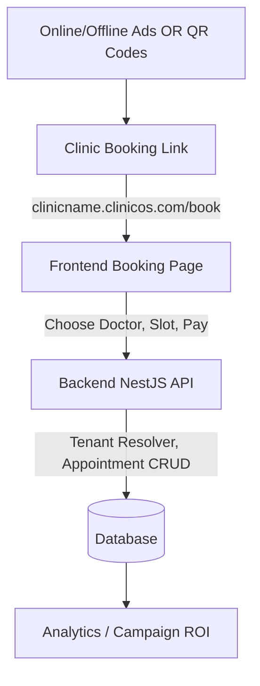

# 🚀 ClinicOS (Multi-Tenant Appointment and Patient Records SaaS)

ClinicOS (also known as ClicniOS) is a production-ready, multi-tenant healthcare management SaaS platform designed to serve multiple clinics from a single scalable system.

This platform focuses heavily on patient acquisition, booking conversions, and marketing in addition to traditional clinic automation, patient record management, and appointment scheduling.

This system is built for scalability, performance, and long-term SaaS monetization.

---

# 🎯 Core Objectives

- Serve multiple clinics (tenants) under one platform
- Isolate tenant data securely
- Enable seamless patient self-serve booking flows
- Empower clinics with built-in marketing and growth tools
- Provide role-based access control (RBAC)
- Manage subscription lifecycle per tenant
- Allow Super Admin full governance
- Maintain production-grade performance and clean architecture

---

# 🏗 Architecture & Tenant Isolation

## System Type

Multi-Tenant SaaS (Single Database, Tenant Isolation via `clinicId`)

Each record in the system is linked to `clinicId` and isolation is enforced at the database query, service, and guard/middleware layers.

## Subdomain-Based Routing
To enhance public branding, each clinic gets a unique subdomain:
`clinicname.clinicos.com`

- The backend resolves the tenant automatically using the subdomain.
- Middleware attaches `tenantId` to all requests.
- Booking pages dynamically load **clinic-specific branding, doctors, and schedules**.

Alternative approaches for future tiers include slug-based URLs (`clinicos.com/clinic/clinicname`) and Custom Domains (`www.clinicname.com`).

---

# 📅 Unique Public Booking Methods & Flow

- **Unique Booking URL per Clinic**: e.g. `clinicname.clinicos.com/book`
- **QR Code Generator**: Patients scan to be redirected to the clinic's booking page, ideal for online and offline marketing campaigns.
- **WhatsApp Integration**: Optional quick chat integration for seamless communication.

## Patient Booking Flow



---

# 📢 Clinic Marketing Features

## Option A — Self-Marketing
- Provide clinics with direct booking links and dynamic QR codes.
- Easy integrations for Google My Business and Social Media profiles.

## Option B — Managed Marketing Service
- Run ads and patient acquisition for clinics.
- Facebook/Instagram Ads with local targeting.
- Google Search Ads capturing high-intent traffic.
- SEO Landing Pages to rank for [specialty] + [city].
- Track appointments specifically booked via ads to demonstrate ROI.
- Billing via monthly subscription or customizable per-booking commissions.

---

# 🪄 Conversion & UX Enhancements

Optimizing the booking funnel is a top priority:
- Page loading speed < 2 seconds
- Doctor profiles with photos, specialties, ratings, and reviews
- Real-time availability of appointment slots
- Online payment processing for premium plans
- Automated email and SMS appointment reminders
- Automated patient follow-ups and rebooking triggers

---

# 👑 Roles & Access Model

## Global Role
- **Super Admin** (Platform Owner)
  - Create/Suspend active clinics
  - Manage plans, overrides, and global analytics

## Tenant-Level Roles
- **Clinic Admin** (Owner)
- **Doctor**
- **Receptionist**

---

# 💳 Subscription & Tenant Control Logic

Each clinic tenant has a Subscription Plan, Status (Active/Suspended/Expired), Billing Cycle, and Expiry Date.

Access Control Rules:
1. **Per-Request Check**: Verify subscription status (Expired blocks API, Suspended returns 403).
2. **Login Check**: Ensure valid subscription before issuing JWT.
3. **Automated Expiry**: Cron jobs run daily to auto-expire elapsed tenants.

---

# 🧩 Core Modules

1. **Tenant Management Module**: Create clinic, assign plans, tracking.
2. **Authentication Module**: JWT, RBAC guards, tenant-aware validation.
3. **User Management**: Staff CRUD, role assignments.
4. **Patient Management**: CRUD, medical history, visit tracking.
5. **Appointment Module**: Doctor scheduling, conflict detection.
6. **Public Booking & QR**: Subdomain resolution, QR generation, patient self-booking APIs.
7. **Marketing & Analytics**: Ad tracking ROI, monthly growth, revenue records, doctor performance.

---

# 🧱 Database Design Strategy

All tenant-specific tables (Clinic, Subscription, User, Patient, Appointment, VisitLog, RevenueRecord) include an indexed `clinicId`. Additional crucial indexes include `appointmentDate`, `doctorId`, and `subscriptionExpiry` for performance.

---

# 🧠 Tech Stack (Production Ready)

## Frontend
- Next.js (App Router)
- TypeScript
- Tailwind CSS
- React Query
- Role-based layout system

## Backend
- NestJS
- PostgreSQL & Prisma ORM
- JWT Auth & RBAC Guards
- Global Tenant Middleware

## Infrastructure
- Dockerized & Nginx reverse proxy
- PM2 process management
- Platform CI/CD ready

---

# ⚡ Performance & Security Strategy

- Proper DB indexing, pagination, caching layer readiness (Redis).
- BCrypt hashing, class-validator, tenant isolation middleware.
- Rate limiting, helmet security headers.

---

# 📂 Recommended Folder Structure (Backend)

```text
src/
  modules/
    auth/
    tenant/
    subscription/
    users/
    patients/
    appointments/
    dashboard/
    booking/ (Public booking module)
    marketing/ (QR, Ads, ROI tracking)
  common/
    guards/
    decorators/
    middleware/
```

---

# 💰 Monetization & Long-Term Vision

**Plan Tiers**: Basic (Limited Staff/Analytics), Pro (Unlimited Doctors, Reminders), Enterprise (Custom Domains, Priority Support).

**Advanced Monetization Ideas (Roadmap)**:
- Telemedicine and online consultations
- Patient subscription models for chronic care
- AI-powered symptom checker & scheduling
- Advanced marketing campaign ROI dashboard
- Multi-country subscription billing

---

# 👨‍💻 Platform Owner

Muhammad Tahir
Full-Stack Systems Architect
Building scalable vertical SaaS systems.
